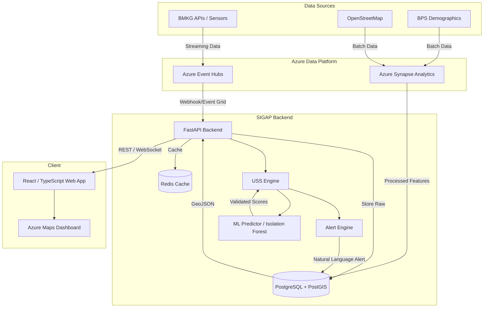

# SIGAP System Architecture

SIGAP (Sistem Intelijen Geospasial Ancaman Perkotaan) dirancang dengan arsitektur *event-driven* yang menggabungkan kemampuan komputasi _on-the-fly_ dengan analitik skala besar menggunakan ekosistem Azure.

## High-Level Data Flow

## Component Details

### 1. Ingestion Layer (Azure Event Hubs & Synapse)
Data cuaca (curah hujan, suhu) yang bersifat temporal masuk secara *streaming* melalui **Azure Event Hubs**. Data demografi dan infrastruktur yang lebih statis diproses secara *batch* menggunakan **Azure Synapse Analytics**. Proses ETL (Extract, Transform, Load) mengubah raw JSON menjadi matriks indikator.

### 2. Storage Layer (PostgreSQL/PostGIS)
Semua kelurahan dipetakan sebagai poligon spasial dalam PostGIS. Hal ini memungkinkan query *geospatial* cepat (misal: mencari kelurahan prioritas dalam radius tertentu dari pos pemadam kebakaran). Redis digunakan untuk melakukan *caching* perhitungan USS yang berat.

### 3. Computation Layer (USS Engine & ML)
- **USS Engine**: Menghitung Urban Stress Score menggunakan formula kerangka pengkajian risiko BNPB: `Risiko = (Kerawanan × Kerentanan) / Kapasitas`.
- **Cascading Failure**: Komputasi non-linear yang melipatgandakan risiko jika ≥2 dimensi berada dalam keadaan krisis.
- **ML Predictor**: Pipeline `LightGBM` untuk prediksi risiko di masa depan dan `Isolation Forest` untuk memvalidasi bahwa lonjakan data cuaca benar (bukan sekadar anomali sensor rusak).

### 4. Alert Engine (NLG)
Mesin *rules-based* sederhana yang menerjemahkan angka matematis menjadi instruksi operasional berbahasa Indonesia (misal: "Rekomendasi: inspeksi fisik drainase di RW prioritas dalam 48 jam").

### 5. Frontend & Visualization
React dashboard terintegrasi dengan komponen peta (menggunakan fallback SVG atau Azure Maps). Mengkonsumsi API secara asinkronus untuk menampilkan *Choropleth map* interaktif.
